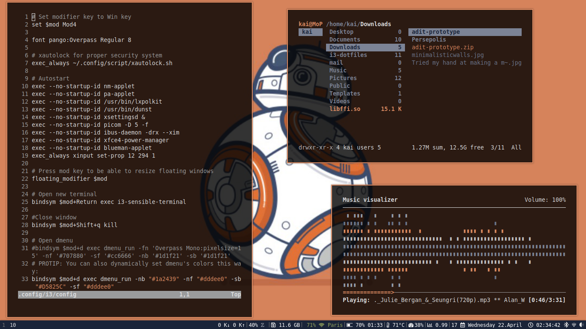
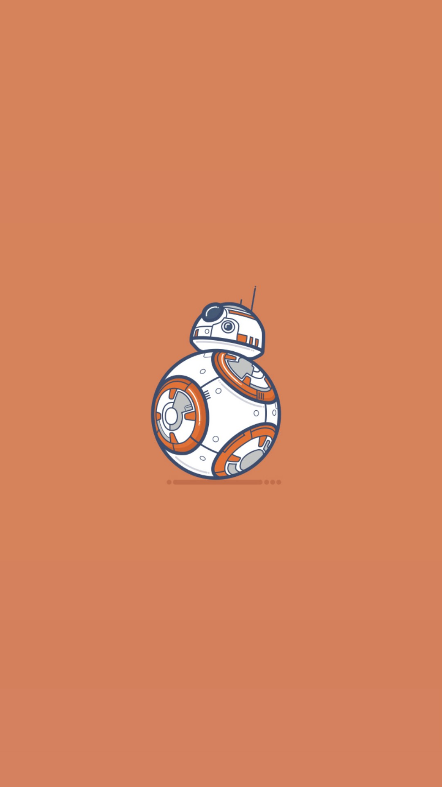

# BB-Droid-Arch-Rice
An Arch Linux rice with i3wm and super minimal applications. 

How it looks like?


## Install Arch Linux
Follow the official Arch wiki [installation guide](https://wiki.archlinux.org/index.php/installation_guide).

Install necessary packages such as Xorg, Display Manager, Network Manager etc.
> I personally don't use a display manager. I simply do **startx**.

## Install i3wm and other additional packages
###### Install i3wm
```
sudo pacman -S i3-wm dunst i3lock i3status
```
###### Install some other additional packages as described [here](https://github.com/addy-dclxvi/i3-starterpack#explanations-of-additional-packages).
```
sudo pacman -S compton hsetroot rxvt-unicode xsel rofi xsettingsd lxappearance scrot viewnior
```
## Setting wallpaper
Right click and save this wallpaper. Place it on `~/Pictures/Wallpapers/`
This wallpaper is from [wallhere.com](https://wallhere.com/en/wallpaper/1295445)

## Copy configurations
```
git clone https://github.com/EnigmaticJihad/BB-Droid-Arch-Rice.git
```
**DO NOT JUST COPY THE CONFIGURATION. GO THROUGH THE CONFIGURATION TO FIGURE OUT WHAT BEST FOR YOU** 

## Themeing & Icons
###### Themeing
Simply copy the oomox-bb-droid theme into your `~/.themes` directory and apply with lxapprearence.
###### Icons
One of the best icon theme i found out there is [**Simply Circle Icon Theme**](https://github.com/ju1464/Simply_Circles_Icon_Theme)
Just Clone and place it into your `~/.icons` directory.
```
git clone https://github.com/ju1464/Simply_Circles_Icons.git && cd Simply_Circles_Icon_Theme-master && cp Simply-* ~/.icons
```
## Colorscheme
to generate the colorscheme from wallpaper I used **Pywal**
###### Install Pywal
You should have python 3.5 or above. 
```
sudo pacman -S feh imagemagick python-pip python-pywal
```
###### Using Pywal
```
wal -i ~/Pictures/Wallpapers/bb-droid.jpg
```
> You can generate colorscheme from any pictures.

## Font
I used the Overpass font for my entire system (including gtk applications). **Powerline patched font for terminal**
###### Install Overpass font
```
yay -S otf-overpass
```
## Enjoy
**I didn't mess up with the default keybindings. It's upto you.**
**Thank you!**
